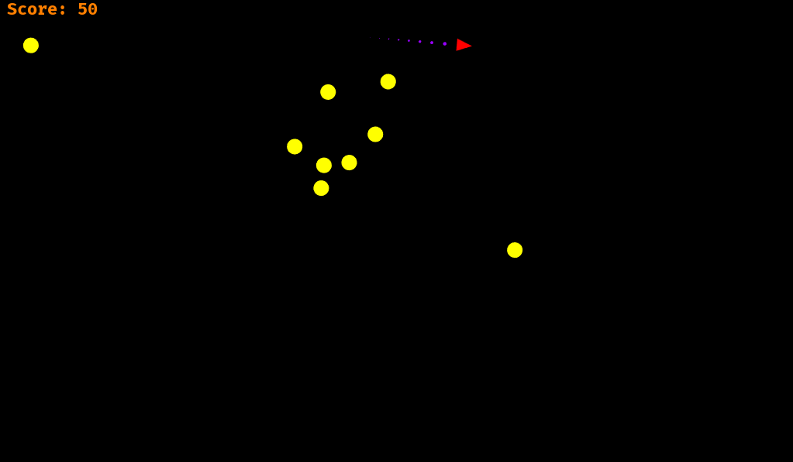

Rocket on WASM
==============

An adapted version of the [Rocket](https://github.com/aochagavia/rocket) game, running on WASM!

[Read the blog post](https://ochagavia.nl/blog/rocket-a-rust-game-running-on-wasm/)
about the development of this WASM version (includes an embedded canvas where you can play the game).

## Screenshot



## How to play

As you can see in the screenshot, you are the red rocket and have to save the world from
the yellow invaders. To do so, you can use the following controls:

Keyboard                | Action
----------------------- | ------------
<kbd>&uparrow;</kbd>    | Boost
<kbd>&leftarrow;</kbd>  | Rotate left
<kbd>&rightarrow;</kbd> | Rotate right
<kbd>Space</kbd>        | Shoot

## Compiling and running

Follow the steps on the [hellorust website](https://www.hellorust.com/setup/wasm-target/)
in order to set up everything. Besides the `wasm32-unknown-unknown` target, the `post_build.py`
script requires python 2.7 and `wasm-gc`.

After setting things up, you should be able to compile the code using the commands below:

```
cargo build --release --target wasm32-unknown-unknown
python post_build.py
```

The generated wasm will be copied to the `html` directory and `wasm-gc`ed.

```
python -m SimpleHTTPServer
```

Try opening http://localhost:8000/ on your browser to check whether it works.

## Related projects

* [Running Rocket in a Python environment through WebAssembly](https://almarklein.org/python_and_webassembly.html)
